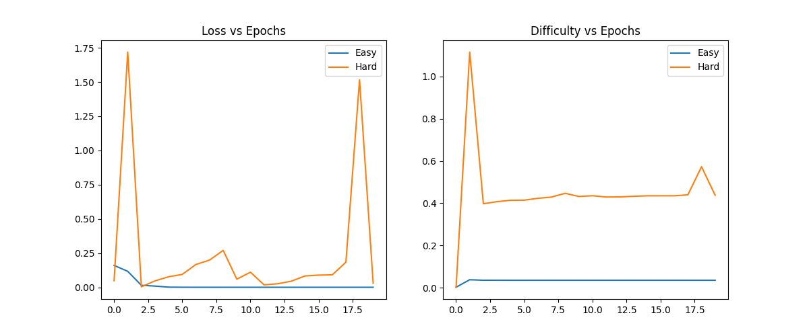
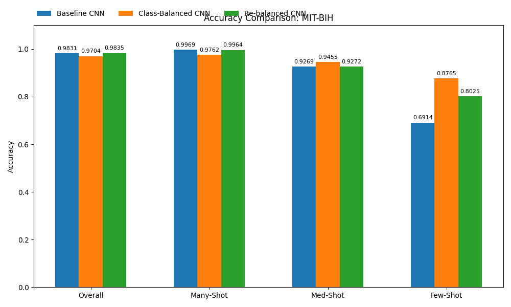
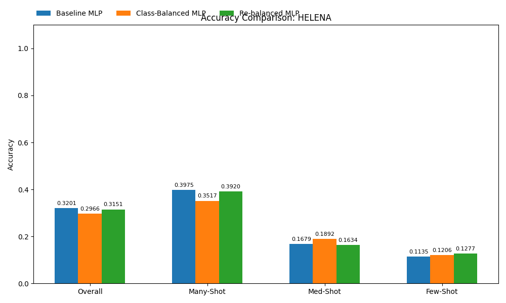

<h1 align="center"> ILR: Instance-Level Re-Balancing for Class-Imbalanced Classification
</h1>

**ILR** (Instance-Level Re-balancing) is a dynamic data resampling framework that prioritizes "difficult" samples by tracking their learning speed. Inspired by human learning, it measures an instance's difficulty based on its unlearning frequency—how often the model's prediction accuracy drops between training epochs—and dynamically adjusts sampling weights to focus on these hard-to-learn instances.


<p align="center">
  <b>Figure 1:</b> Visualization of training dynamics. The plots show Loss and Instance Difficulty tracking for "Easy" vs. "Hard" samples over 20 epochs on the MIT-BIH dataset.
</p>

ILR achieves **competitive performance** on long-tailed datasets by successfully identifying and re-weighting minority sub-classes and difficult majority-class instances, outperforming traditional class-level balancing methods (like Inverse Frequency) in Many-Shot, Med-Shot, and Few-Shot scenarios.

<p align="center">
  
  
</p>

<p align="center">
  <b>Figure 2:</b>
  (a) Accuracy comparison on the MIT-BIH (ECG) dataset using CNNs.
  (b) Accuracy comparison on the HELENA (Proteomics) dataset using MLPs.
</p>

> [!NOTE]
> Performance metrics are categorized by "Shots": **Many-Shot** (>1000 samples), **Med-Shot** (100-1000 samples), and **Few-Shot** (<100 samples). While ILR effectively reduces bias, it cannot synthesize information; extremely low-sample classes may still hit a "representation wall" if the underlying data lacks diversity.

## Environment Setup

Set up the Python environment and install the required dependencies:

```shell
pip install torch pandas numpy scikit-learn matplotlib
```

## Dataset Format

This repository supports tabular and signal data in CSV format. Examples for **MIT-BIH** and **HELENA** are provided.

### 1. Directory Structure
Datasets should be placed in their own directory (e.g., `./mitbih/`).

### 2. Required Files
For each dataset, you need:
- `*_train.csv` — Training samples with labels in the last column.
- `*_test.csv` — Test samples with labels in the last column.

### 3. CSV Format
The data should be comma-separated, where each row is a sample and the last column is the integer class label.

```csv
0.97, 0.86, 0.45, ..., 0
0.61, 0.55, 0.32, ..., 1
```

## Configuration and Hyperparameters

Training parameters are configured within the evaluation scripts (`evaluate_mitbih.py` or `evaluate_helena.py`).

### Key Hyperparameters
- `c` — Smoothing prior constant (default: `1.0` or `0.01`). Higher values stabilize early training but reduce sensitivity to unlearning.
- `epochs` — Total training iterations (default: `20` to `100`).
- `batch_size` — Samples per gradient update (default: `128` to `512`).
- `use_cumulative` — Boolean to decide whether to use accumulated difficulty over all previous epochs (default: `True`).

## Usage

Run the evaluation scripts to train models and generate result tables/figures:

```shell
# For MIT-BIH (ECG Signal Classification)
python evaluate_mitbih.py

# For HELENA (Tabular Proteomics Classification)
python evaluate_helena.py
```

These scripts will automatically:
1. Preprocess the data.
2. Train **Baseline**, **Class-Balanced**, and **Proposed Re-balanced** models.
3. Export comparison results to `.csv` and generate visualization plots (`figure_*.png`).

## Citation
If you find this implementation useful in your research, please cite the original paper:
```bibtex
@article{yu2021rebalancing,
  title={A Re-Balancing Strategy for Class-Imbalanced Classification Based on Instance Difficulty},
  author={Yu, Liang and others},
  journal={arXiv preprint},
  year={2021}
}
```
